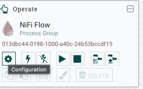
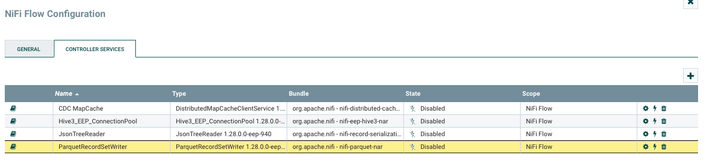
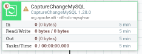
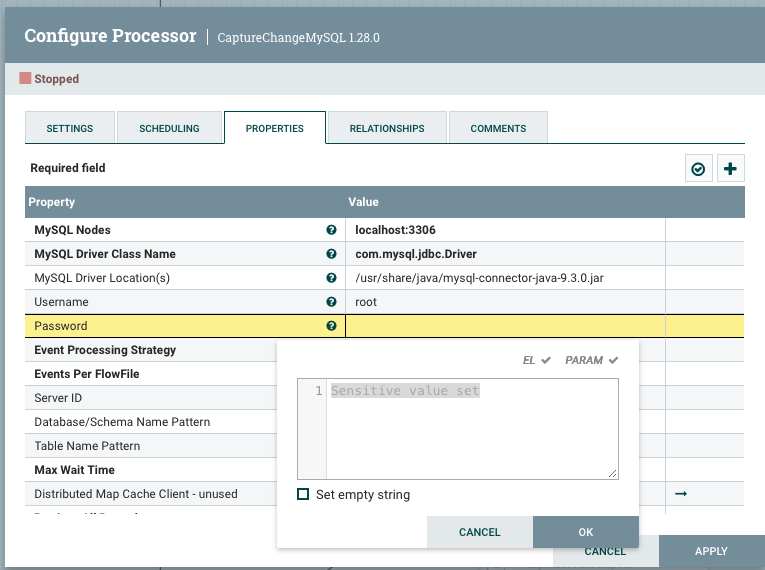

# Data Fabric Demo with CDC


## Demo Flow


- Open [NiFi](https://localhost:12443/nifi) to configure passwords and enable controllers
    - Login with `admin/Admin123.Admin123.` (or use your credentials if you've changed in the `docker-compose.yaml` file).

    - Drag "Process Group" from top of the page onto Canvas, browse to upload the .

        - Select the Process Group, and select  for "NiFi Flow".
    
            - In the "Controller Services" tab,
        
                - Enable  by clicking the lightning icon and then "Enable".
    
            - Enter into "Process Group" by double-click.
    
        - Double-click on , enter .
    
    - Click on empty space and select "Play" button to start all processors.


- Insert records to the pre-configured MySQL table `users`

    - Run `uv run users.py`

- Check NiFi flow to see processed flows & modified files written as JSON documents

    - It will take few seconds to reflect the process on UI, but you should see files immediately
    
    - `ls /mapr/dfab.io/demovol/users/`


- (Optional) Query JSON files with Drill

    `/opt/mapr/drill/drill-1.21.2/bin/sqlline -u 'jdbc:drill:drillbit=dfab.io:31010;auth=MAPRSASL'`

    then Run

    ```sql
    select * from dfs.`/demovol/users/`;
    ```

- Repeat last two steps side by side, so run `users.py` to send new records to MySQL, and run `select * from` query to see updated records immediately.
